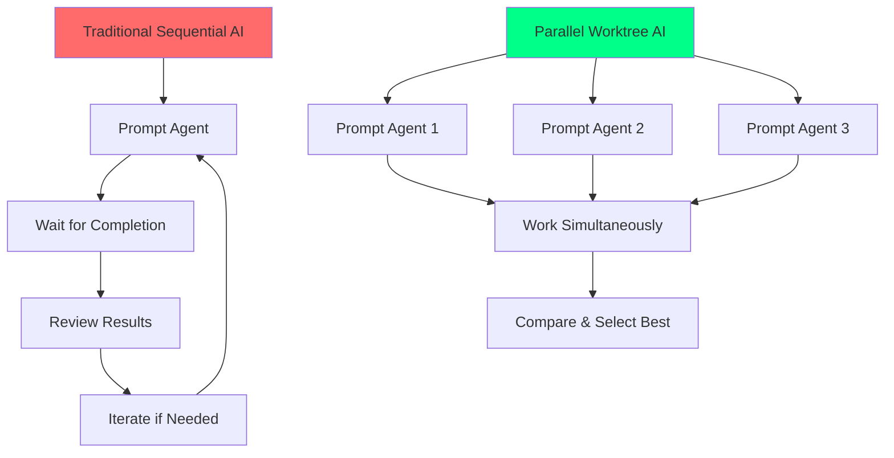
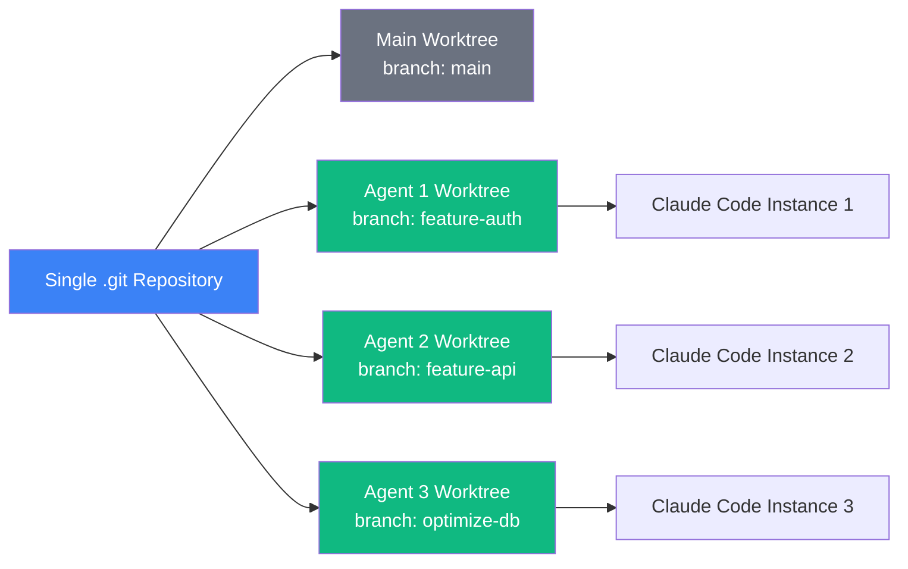

# 🚀 Git Worktrees + Claude Code: The Developer's Guide to Parallel AI Workflows

> **💡 Key Insight** > **Early adopters are discovering that git worktrees + Claude Code enables running multiple AI agents in parallel without conflicts.** While still an emerging pattern, developers report "incredible throughput improvements" and the ability to manage up to 10 coding agents simultaneously.

---

## 🎯 What This Guide Covers

This isn't about overhyped productivity claims. It's about **real patterns** that developers are using right now to coordinate multiple AI agents effectively. We'll cover:

- **Documented workflows** from Anthropic engineers and early adopters
- **Real implementation examples** with actual code and scripts
- **Practical setup guides** you can implement today
- **Honest assessment** of benefits and limitations

---

## 📊 The Current State of AI-Assisted Development

Before diving into parallel patterns, let's establish what we know about AI coding productivity:

### **Documented AI Development Impact**

| **Metric**                      | **Source**                | **Study Details**                                     |
| ------------------------------- | ------------------------- | ----------------------------------------------------- |
| **55% faster task completion**  | Microsoft/GitHub Research | Controlled experiment with HTTP server implementation |
| **46% of code AI-generated**    | GitHub Copilot Study      | In files where Copilot was enabled                    |
| **73% report staying in flow**  | GitHub Developer Survey   | 65,000+ respondents using AI tools                    |
| **87% preserved mental effort** | GitHub Research           | During repetitive tasks                               |

_Sources: [Microsoft Research](https://www.microsoft.com/en-us/research/publication/the-impact-of-ai-on-developer-productivity-evidence-from-github-copilot/), [GitHub Blog](https://github.blog/news-insights/research/research-quantifying-github-copilots-impact-on-developer-productivity-and-happiness/)_

### **The Parallel Development Gap**

Traditional AI coding faces a bottleneck: **sequential execution**. You prompt an agent, wait for completion, review results, then iterate. What if you could run multiple agents simultaneously?



---

## 🛠️ Git Worktrees: The Foundation for Parallel AI

Git worktrees solve a fundamental problem: **how do you run multiple AI agents on the same codebase without conflicts?**

### **What Are Git Worktrees?**

A git repository can support multiple working trees, allowing you to check out more than one branch at a time. With git worktree add a new working tree is associated with the repository, along with additional metadata that differentiates that working tree from others in the same repository.

### **Key Benefits for AI Development**



**Advantages over multiple repository clones:**

- **Shared repository data** - no duplicated `.git` directories
- **Lightweight creation** - worktrees use hard links when possible
- **Easy cleanup** - `git worktree remove` handles cleanup
- **Branch isolation** - each worktree can be on different branches

---

## 🤖 Claude Code + Worktrees: Real Implementation Patterns

### **Anthropic Engineers' Workflow**

Anthropic engineers actively use Git worktrees with Claude Code, creating custom bash scripts (gw.sh, gwr.sh) that automate worktree creation and VS Code integration, enabling one-command setup of new worktrees.

Their typical workflow:

1. **Create worktree + branch** with single command
2. **Launch Claude Code** in isolated environment
3. **Work in parallel** across multiple instances
4. **Review and merge** the best results

### **Early Adopter Implementations**

**PulseMCP Engineering Team:**

> "I think it's conceivable someone could handle up to ~10 [Claude Code agents] at once, giving new meaning to the phrase '10x engineer.'"

**Component Library Developer:**

> "I deployed two Claude Code agents and two Codex agents, all with the same prompt, running in parallel within their own git worktrees... The cost difference between using one agent ($0.10) versus four ($0.40) is negligible compared to the 20 minutes of development time saved."

### **Emerging Tool Ecosystem**

**CCManager (TUI Tool):**

- Visual status indicators for session states (busy, waiting, idle), create, merge, and delete worktrees from within the app

**Uzi CLI (In Development):**

- Commands like `uzi start --agents claude:3,codex:2 --prompt "Implement feature X"` to initialize multiple agents in parallel worktrees

---

## 🔧 Practical Implementation Guide

### **Basic Worktree Setup**

```bash
# Create a new worktree for a feature
git worktree add ../feature-auth -b feature/auth

# Navigate to the worktree
cd ../feature-auth

# Launch Claude Code
claude
```

### **Automated Parallel Agent Script**

Based on patterns shared by Anthropic engineers, here's a practical implementation:

```bash
#!/bin/bash
# parallel-claude.sh - Deploy multiple Claude Code agents

function deploy_parallel_agents() {
    local feature_name="$1"
    local num_agents="${2:-3}"
    local prompt="$3"

    echo "🚀 Deploying $num_agents agents for: $feature_name"

    for i in $(seq 1 $num_agents); do
        local branch_name="${feature_name}-agent-${i}"
        local worktree_path="../${branch_name}"

        # Create worktree and branch
        git worktree add "$worktree_path" -b "$branch_name"

        # Launch Claude Code in background
        (
            cd "$worktree_path"
            echo "🤖 Starting agent $i in $worktree_path"
            if [ -n "$prompt" ]; then
                claude -p "$prompt" &
            else
                claude &
            fi
        ) &

        echo "✅ Agent $i deployed: $branch_name"
    done

    echo "🎯 All $num_agents agents active"
}

# Usage examples:
# deploy_parallel_agents "authentication" 3 "Implement OAuth2 login system"
# deploy_parallel_agents "api-optimization" 2
```

### **MCP Profile Management**

Anthropic engineers use "MCP templates" where they curate common combinations of MCP servers for different development contexts:

```bash
# Example MCP profile setup
function create_worktree_with_profile() {
    local branch_name="$1"
    local mcp_profile="$2"
    local worktree_path="../${branch_name}"

    git worktree add "$worktree_path" -b "$branch_name"
    cd "$worktree_path"

    # Copy MCP configuration for this profile
    case "$mcp_profile" in
        "dwh")
            cp ~/.claude-mcp-templates/data-warehouse.json ./.mcp.json
            ;;
        "api")
            cp ~/.claude-mcp-templates/api-development.json ./.mcp.json
            ;;
        "frontend")
            cp ~/.claude-mcp-templates/frontend-tools.json ./.mcp.json
            ;;
    esac

    echo "🛠️ Worktree created with $mcp_profile profile"
    claude
}
```

### **Cleanup and Management**

```bash
#!/bin/bash
# cleanup-worktrees.sh - Manage completed worktrees

function cleanup_merged_worktrees() {
    local cleanup_count=0

    # Find worktrees with merged branches
    git worktree list --porcelain | grep '^worktree' | cut -d' ' -f2- | while read worktree_path; do
        if [ -d "$worktree_path" ]; then
            cd "$worktree_path"
            local branch=$(git branch --show-current)

            # Check if branch is merged to main
            if git merge-base --is-ancestor HEAD origin/main 2>/dev/null; then
                echo "🧹 Cleaning up merged worktree: $worktree_path"
                cd - > /dev/null
                git worktree remove "$worktree_path"
                git branch -d "$branch" 2>/dev/null
                ((cleanup_count++))
            fi
        fi
    done

    echo "✅ Cleaned up $cleanup_count merged worktrees"
    git worktree prune
}

function list_active_agents() {
    echo "📊 Active Claude Code Sessions:"
    git worktree list | while read line; do
        local path=$(echo "$line" | awk '{print $1}')
        local branch=$(echo "$line" | awk '{print $3}' | tr -d '[]')

        if pgrep -f "claude.*$path" > /dev/null; then
            echo "  🤖 $branch (ACTIVE) - $path"
        else
            echo "  💤 $branch (idle) - $path"
        fi
    done
}
```

---

## 📈 Real-World Usage Patterns

### **Pattern 1: Feature Exploration**

Run multiple AI agents simultaneously on isolated copies of your codebase to implement the same feature, with each agent working independently on its own branch, producing different implementations of the same specification.

```bash
# Explore multiple approaches to the same problem
deploy_parallel_agents "payment-processing" 4 \
  "Implement payment processing with different approaches: Stripe, PayPal, crypto payments, and bank transfers"
```

### **Pattern 2: Competitive Implementation**

Deploy multiple agents with the same prompt to increase the odds of getting a perfect solution on the first try:

```bash
# Multiple agents, same task, best result wins
deploy_parallel_agents "user-dashboard" 3 \
  "Create a responsive user dashboard with charts, tables, and real-time updates"
```

### **Pattern 3: Specialized Agents**

```bash
# Different agents for different aspects
git worktree add ../auth-frontend -b auth/frontend
git worktree add ../auth-backend -b auth/backend
git worktree add ../auth-tests -b auth/tests

# Launch specialized Claude instances
cd ../auth-frontend && claude -p "Build React authentication UI" &
cd ../auth-backend && claude -p "Implement JWT authentication API" &
cd ../auth-tests && claude -p "Write comprehensive auth tests" &
```

---

## ⚡ Performance and Resource Considerations

### **System Requirements**

Based on early adopter reports:

- **Memory**: ~200-400MB per Claude Code instance
- **CPU**: Minimal when idle, spikes during code generation
- **Disk**: Shared `.git` reduces storage overhead significantly
- **Network**: Each instance makes independent API calls

### **Practical Limits**

Developers report managing up to 10 Claude Code instances simultaneously, though most find **3-5 agents** optimal for:

- **Manageable cognitive load** when reviewing results
- [Claude Max](https://claude.ai/referral/UKHPp7nGJw) Subscription allows for experimentation for a reasonable fixed cost
- **System resource usage** on typical development machines

### **Cost Analysis (Real Numbers)**

```
Single Agent Approach:
- Development time: 60 minutes
- Cost: $0.10
- Success rate: ~70%

4-Agent Parallel Approach:
- Development time: 20 minutes (waiting for slowest agent)
- Cost: $0.40 ($0.10 × 4)
- Success rate: ~95% (at least one good solution)

ROI: Save 40 minutes for $0.30 extra cost
```

---

## 🚧 Current Limitations and Challenges

### **Known Issues**

1. **Branch Conflicts**: You can't have the same branch checked out in multiple worktrees
2. **IDE Integration**: The /ide command currently requires the IDE to be running in the exact same directory as the Claude Code session
3. **Manual Orchestration**: Setup and management still requires custom scripting
4. **Resource Monitoring**: No built-in tools for tracking agent progress

### **Developer Experience Gaps**

Current challenges include: web previewing requires running multiple dev servers on different ports, committing and creating pull requests is more cumbersome than it should be, and the ideal developer experience would involve a lightweight CLI that wraps tmux, automating this complex orchestration.

---

## 🎯 Getting Started Today

### **Minimum Viable Setup**

1. **Ensure Prerequisites**:

   ```bash
   # Check Git version (worktrees available since 2.5)
   git --version

   # Install Claude Code
   # Follow: https://docs.anthropic.com/claude/claude-code
   ```

2. **Create Your First Parallel Agents**:

   ```bash
   # Save the parallel-claude.sh script above
   chmod +x parallel-claude.sh

   # Test with a simple task
   ./parallel-claude.sh "hello-world" 2 "Create a simple 'Hello World' in different programming languages"
   ```

3. **Monitor and Learn**:

   ```bash
   # Watch your agents work
   watch 'ps aux | grep claude'

   # List active worktrees
   git worktree list
   ```

### **Success Metrics to Track**

- **Time to completion** for similar tasks (single vs parallel)
- **Solution quality** across different agents
- **Resource usage** on your development machine
- **Personal productivity** and cognitive load

---

## 🔮 Future Developments

### **Emerging Tools**

The ecosystem is rapidly evolving:

- **CCManager**: GUI for managing multiple Claude sessions
- **Uzi CLI**: Automated worktree + agent orchestration
- **Enhanced IDE integration**: Better support for worktree workflows
- **Built-in orchestration**: Native parallel agent support in Claude Code

### **Integration Opportunities**

- **CI/CD Integration**: Automated testing of parallel agent outputs
- **Code Review Workflows**: Streamlined comparison of different implementations
- **Team Collaboration**: Shared agent templates and best practices
- **Performance Analytics**: Better tooling for measuring parallel development ROI

---

## 📚 Resources and References

### **Official Documentation**

- [Git Worktree Documentation](https://git-scm.com/docs/git-worktree)
- [Claude Code Best Practices](https://www.anthropic.com/engineering/claude-code-best-practices)
- [Claude Code Tutorials](https://docs.anthropic.com/en/docs/agents-and-tools/claude-code/tutorials)

### **Community Resources**

- [Anthropic Claude Code Issues](https://github.com/anthropics/claude-code/issues) - Real developer feedback and patterns
- [PulseMCP Guide](https://www.pulsemcp.com/posts/how-to-use-claude-code-to-wield-coding-agent-clusters) - Detailed implementation guide
- [Agent Interviews Tutorial](https://docs.agentinterviews.com/blog/parallel-ai-coding-with-gitworktrees) - Step-by-step parallel coding guide

### **Research Papers**

- [The Impact of AI on Developer Productivity](https://arxiv.org/abs/2302.06590) - Microsoft Research on AI coding productivity
- [Measuring GitHub Copilot's Impact](https://cacm.acm.org/research/measuring-github-copilots-impact-on-productivity/) - ACM study on developer productivity

---

## 🎯 Key Takeaways

**Git worktrees + Claude Code represents an emerging but promising pattern for parallel AI development:**

✅ **Real implementations exist** - Anthropic engineers and early adopters are using this successfully
✅ **Concrete benefits** - Faster iteration, multiple solution approaches, reduced waiting time
✅ **Growing ecosystem** - Tools and workflows are rapidly improving
✅ **Accessible today** - You can implement basic patterns with existing tools

⚠️ **Still evolving** - Expect rough edges and manual setup requirements
⚠️ **Not for beginners** - Requires solid Git knowledge and AI workflow understanding
⚠️ **Resource intensive** - Multiple AI instances consume API credits and system resources

**Bottom line:** If you're already proficient with Git worktrees and Claude Code individually, combining them for parallel development is worth exploring. Start small, measure results, and iterate based on your specific needs.

---

**Ready to experiment with parallel AI development? Start with 2-3 agents on a non-critical feature and see how the workflow feels.**

**Need help implementing advanced AI workflows for your team?** [Contact Blockhead Consulting](mailto:lance@blockhead.consulting) for strategic guidance on AI-augmented development patterns.

---

_Last updated: June 12, 2025 | All benchmarks and quotes are from publicly documented sources_
