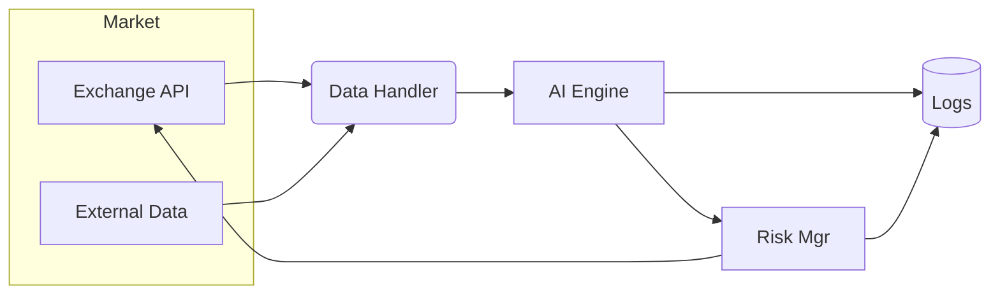
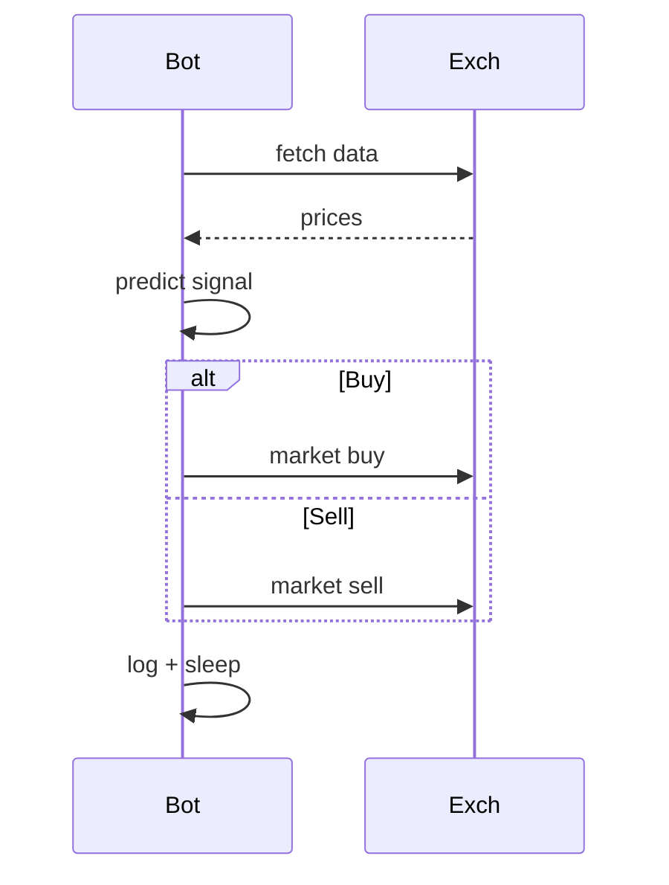

> **Why read this?** > _AI‑powered trading agents are exploding in popularity—267× growth in AI‑agent tokens in 2024 alone._
> This step‑by‑step guide shows **exactly** how to get a prototype running, so you can experiment _today_.

---

## Table&nbsp;of&nbsp;Contents

1. [Prerequisites & Environment](#prerequisites--environment)
2. [Connecting to an Exchange](#connecting-to-an-exchange)
3. [Designing the AI Decision Engine](#designing-the-ai-decision-engine)
4. [Risk Management Basics](#risk-management-basics)
5. [System Architecture](#system-architecture)
6. [Decision Flow Diagram](#decision-flow-diagram)
7. [Next Steps](#next-steps)

---

## Prerequisites & Environment

```bash
python3 -m venv venv
source venv/bin/activate
pip install ccxt pandas numpy scikit-learn python-dotenv
```

Keep your **API keys** in a `.env` file:

```dotenv
BINANCE_API_KEY=your_key
BINANCE_API_SECRET=your_secret
```

Load them in Python:

```python
from dotenv import load_dotenv
import os, ccxt
load_dotenv()
exchange = ccxt.binance({{
    "apiKey": os.getenv("BINANCE_API_KEY"),
    "secret": os.getenv("BINANCE_API_SECRET"),
    "enableRateLimit": True,
}})
```

---

## Connecting to an Exchange

```python
ticker = exchange.fetch_ticker("BTC/USDT")
print(f"Current price: {{ticker['last']}}")
```

Fetching historical candles:

```python
bars = exchange.fetch_ohlcv("BTC/USDT", timeframe="1h", limit=100)
```

---

## Designing the AI Decision Engine

```python
import numpy as np
from sklearn.linear_model import LogisticRegression

X = np.random.randn(1000, 3)
y = (X[:, 0] + 0.5*X[:, 1] + np.random.randn(1000)*0.1 > 0).astype(int)

model = LogisticRegression().fit(X[:800], y[:800])
print("Accuracy:", model.score(X[800:], y[800:]))
```

Integrate into a live loop:

```python
def extract_features(bars):
    # toy example: pct returns
    import numpy as np
    closes = np.array([b[4] for b in bars])
    rets = np.diff(closes)/closes[:-1]
    return rets[-3:]  # last 3 returns as features

position = 0
while True:
    bars = exchange.fetch_ohlcv("BTC/USDT", "1h", limit=50)
    feat = extract_features(bars)
    signal = model.predict([feat])[0]
    ...
```

---

## Risk Management Basics

```python
def pos_size(capital, risk_pct, entry, stop):
    risk_amt = capital * risk_pct
    units = risk_amt / abs(entry - stop)
    return units
```

Key points:

- Max **1‑2 %** risk per trade.
- Always place **stop‑loss** orders immediately.
- Use **paper trading** before real funds.

---

## System Architecture



---

## Decision Flow Diagram



---

## Next Steps

1. Replace the dummy model with **real features** or **RL agents**.
2. Add **websocket** data streams for low‑latency trading.
3. Harden with **comprehensive tests**, monitoring, and _secure_ key storage.

Need help productionizing? **[Contact Blockhead Consulting](mailto:lance@blockhead.consulting)**—we specialize in AI integration and crypto systems.

---
