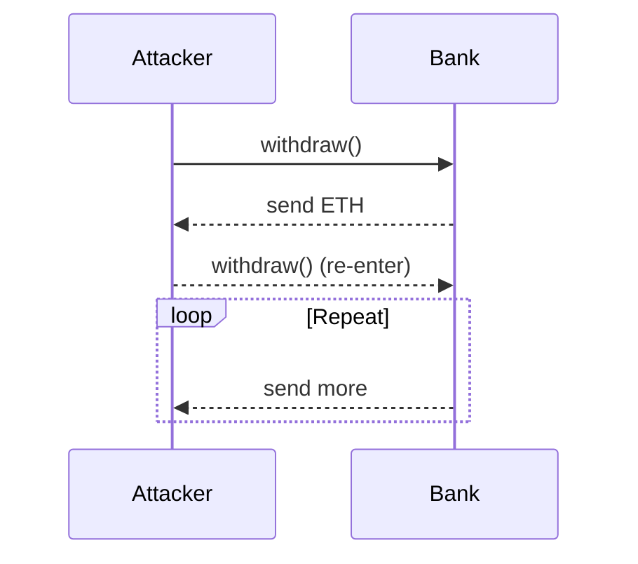
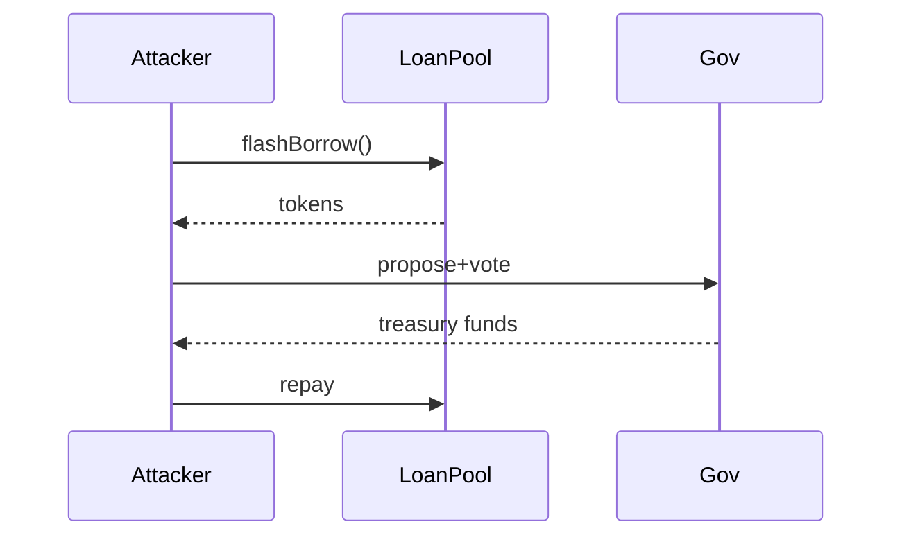

> **TL;DR** > _One overlooked bug can drain **$100 M+** in seconds._
> This guide shows how to combine manual review with Python automation to **catch vulnerabilities early**.

---

## Table of Contents

1. [Top Vulnerabilities](#top-vulnerabilities)
2. [Python Tooling](#python-tooling)
3. [Attack Diagrams](#attack-diagrams)
4. [Case Studies](#case-studies)
5. [Audit Checklist](#audit-checklist)

---

## Top Vulnerabilities

### Reentrancy

```solidity
(bool success,) = msg.sender.call{{value: amount}}("");
require(success, "ETH transfer failed");
balances[msg.sender] -= amount; // <- too late!
```

Apply **Checks‑Effects‑Interactions** or `ReentrancyGuard`.

### Access Control

```solidity
function changeOwner(address _new) external {{
    owner = _new; // 🛑 anyone can own!
}}
```

Fix with:

```solidity
modifier onlyOwner {{ require(msg.sender == owner); _; }}
```

### Oracle Manipulation

Pump price via flash loan → drain protocol collateral. Use **Chainlink** TWAP, sanity bounds, or multi‑source oracles.

---

## Python Tooling

### Quick Regex Scan

```python
import re, pathlib, sys
code = pathlib.Path(sys.argv[1]).read_text()
if re.search(r"\.call\{{?value", code):
    print("⚠️  External call spotted – review for reentrancy")
```

### Slither Static Analysis

```python
from slither import Slither
sl = Slither("MyContract.sol")
for result in sl.run_detectors():
    print(result)
```

### Fuzz Test with Brownie

```python
from brownie import accounts, reverts
def test_no_reentrancy(bank, attacker):
    with reverts():
        attacker.attack({"from": accounts[0]})
```

---

## Attack Diagrams

### Reentrancy



### Flash Loan Governance



---

## Case Studies

- **The DAO (2016):** ~$60 M lost via reentrancy.
- **Beanstalk (2022):** $182 M lost via flash‑loan governance.
- **Mango Markets (2022):** $112 M oracle manipulation.

---

## Need an Expert?

We turn audit reports into **actionable fixes** & provide end‑to‑end security hardening.
**[Reach Out](mailto:lance@blockhead.consulting)**.

---
