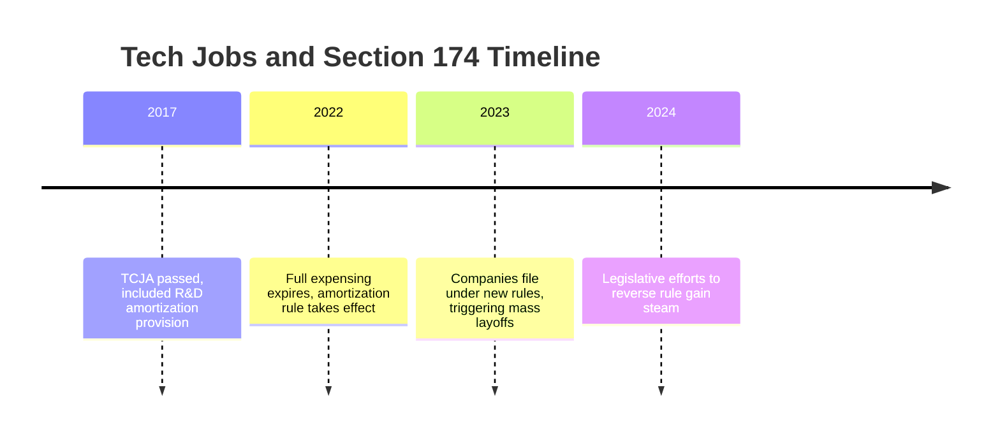
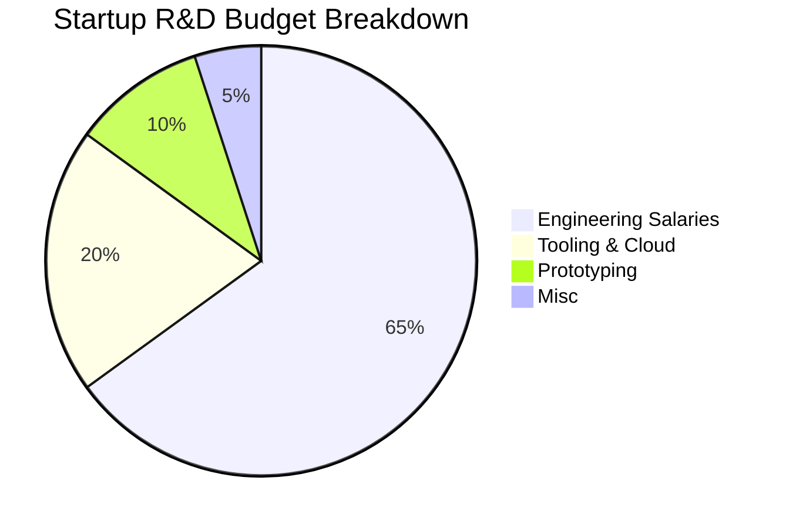
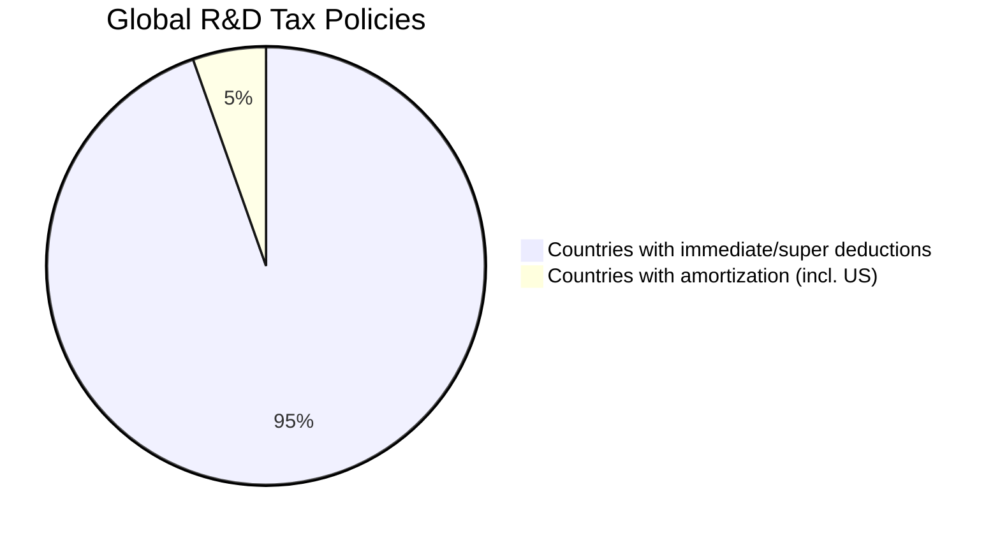

# Why IRC §174—Not AI—Killed Tech Jobs

Tech workers have faced a **brutal reckoning** in the past few years. Over **500,000** employees in the sector were laid off since early 2023 alone. Many headlines blamed over-hiring or the rise of artificial intelligence (AI) as the cause of this downturn. But that narrative misses the mark.

> “How did a single line in the tax code help trigger a tsunami of mass layoffs? And why did no one see it coming?”

In reality, a _hidden time bomb in the U.S. tax code_ is the true culprit behind the tech job purge: the expiration of **IRC §174**. This post breaks down what really happened and explains why AI isn't the villain it's made out to be.

## A Tax Break That Built Tech—Until It Expired

From 1954 to 2021, **Section 174** of the Internal Revenue Code allowed companies to **immediately deduct 100% of research and development (R&D) expenses**, including salaries of engineers and developers. But a clause in the **2017 Tax Cuts and Jobs Act (TCJA)** changed that. Starting in **2022**, businesses were forced to **amortize domestic R&D over 5 years**, and **foreign R&D over 15 years**.

> “In 2022, a startup that spent $5M on R&D could only deduct $500K.” — [Cooley LLP](https://www.cooley.com/news/insight/2023/2023-05-01-tax-update-irs-releases-guidance-on-new-rd-rules)

This led to **surprise tax bills**, **reduced hiring**, and a **direct increase in taxable income**—especially devastating for startups and R&D-heavy tech companies.

## Innovation on Ice

Companies suddenly had to pay taxes on expenses they couldn’t deduct, leaving **less capital for hiring and product development**. It hit hardest where innovation was most active.

- **Startups** operating at a loss still owed taxes
- **Tech giants** slashed experimental projects
- **Investors** demanded profitability, pressuring teams to cut R&D

> “I can deduct my salespeople, but I can’t deduct my engineers.” — Cybersecurity Lab CEO via [CNBC](https://www.cnbc.com/2023/04/)

The U.S. became **1 of only 2 developed nations** that requires amortizing R&D. Meanwhile, **17 countries** now offer **super-deductions** (greater than 100%).

## Tech’s Great Downsizing: IRC §174 Triggered It

In 2023, mass layoffs began—many firms slashing **10-25%** of their workforce. While AI was blamed, internal reports and earnings statements pointed to something else: **R&D became too expensive to carry.**

- **Meta** cut 21,000+ jobs citing “efficiency” after amortization rules took effect
- **Google, Microsoft, Amazon, Salesforce** all cut 6–30% of staff
- **VC-backed startups** paused hiring or revoked offers due to tax liability

> “Headcount—the leading R&D expense—was the easiest thing to cut.” — [Quartz](https://qz.com/tech-layoffs-174-tax-change)

## The AI Scapegoat

AI became the public face of job fears, but it’s not what caused the layoffs.

- AI **boosts productivity**: engineers complete work faster
- Most AI tools assist rather than replace developers
- AI has **created new jobs**: prompt engineers, model integrators, trainers

> “AI enhances productivity by automating the mundane, not replacing creativity.” — Sundar Pichai, [Google CEO](https://www.google.com)

A study by MIT & Stanford showed **14% average productivity gains** with AI assistants. And yet, AI is still blamed for layoffs caused by a tax policy no one talks about.

## Legislative Fixes Are in Motion

Congress is aware of the damage:

- **Bipartisan bills** introduced in 2023, 2024, 2025
- **H.R. 7024** passed in the House to pause amortization, but stalled in Senate
- **H.R. 1990 (2025)** aims to restore immediate expensing retroactively

Even the **White House’s Council of Economic Advisers** supports bringing back full expensing.

> “Expensing R&D is key to innovation, jobs, and competitiveness.” — [CEA](https://whitehouse.gov/cea/)

## Final Thoughts

The real story behind the tech job market collapse isn't AI. It’s **bad policy**—a stealth tax hike that punished innovation. The good news? It can be reversed.

Meanwhile, AI is a force multiplier. The companies that succeed in the next cycle will be those that:

- Fight for better tax treatment of innovation
- Use AI to **supercharge their teams**, not shrink them
- Invest in human+AI workflows for long-term leverage

## Need Help?

If you’re looking to integrate AI into your engineering org, streamline development, or upskill your team with real AI leverage [Reach out](mailto:lance@blockhead.consulting).

---

**Sources:**

- [Cooley LLP](https://www.cooley.com/news/insight/2023/2023-05-01-tax-update-irs-releases-guidance-on-new-rd-rules)
- [Quartz on §174 layoffs](https://qz.com/tech-layoffs-174-tax-change)
- [CNBC on software firm tax bills](https://www.cnbc.com/2023/04/)
- [Tax Foundation](https://taxfoundation.org)
- [White House CEA](https://whitehouse.gov/cea/)
- [MIT + Stanford AI Productivity Study](https://economics.mit.edu/research-studies/generative-ai-work)
